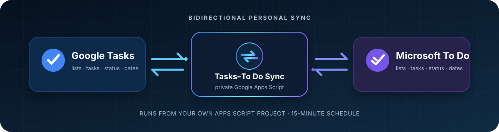

<div align="center">
  
</div>

<h1 align="center">Tasks–To Do Sync</h1>

<p align="center">
  <strong>Keep Google Task and Microsoft To Do in the same task loop.</strong><br>
  A private, self-hosted bridge for people who live in both ecosystems.
</p>

<p align="center">
  <a href="https://github.com/simonchai-tw/tasks-todo-sync/actions/workflows/ci.yml"></a>
  <a href="https://github.com/simonchai-tw/tasks-todo-sync/actions/workflows/github-code-scanning/codeql"></a>
  <a href="https://www.npmjs.com/package/tasks-todo-sync"></a>
  <a href="https://github.com/simonchai-tw/tasks-todo-sync/releases"></a>
  <a href="LICENSE"></a>
  
</p>

<p align="center">
  <a href="#why-this-exists">Why</a> ·
  <a href="#what-syncs">Features</a> ·
  <a href="#how-it-works">How it works</a> ·
  <a href="#get-started">Get started</a> ·
  <a href="#built-in-safeguards">Safeguards</a> ·
  <a href="docs/deployment.md">Deploy</a> ·
  <a href="https://github.com/simonchai-tw/tasks-todo-sync/graphs/contributors">Contributors</a>
</p>

---

## Why this exists

Google Tasks and Microsoft To Do are both useful inside their own ecosystems, but they do not naturally stay in sync.

**Tasks–To Do Sync closes that gap.** It runs inside your own private Google Apps Script project, discovers eligible lists on both sides, and keeps task changes moving between Google Tasks and Microsoft To Do every 10 minutes.

No hosted middleman. No shared client secret. Your accounts, your script, your data.

## v0.1.1 highlights

The `v0.1.1` release tightens the recovery and deployment path for a private, single-operator installation:

- The CLI applies any requested IANA time zone to the Apps Script manifest, including manifests with pretty-printed JSON.
- A round fence preserves the last successful task/list-deletion baseline when a run stops before its final projection.
- Successful-round restore uses a separately recorded successful generation. After an upgrade, complete and verify at least one successful sync before using restore; it does not restore arbitrary checkpoints.
- Google title, date, and completion changes preserve the Microsoft rich-text body. The body is rewritten only when the notes text projection changes.
- Authorization recovery and fatal errors remain bounded; fatal alert email content is redacted.
- Pagination, User Properties storage headroom, and per-round metrics have explicit, verified guardrails. The local release checks are recorded in the [v0.1.1 release checklist](docs/release-v0.1.1.md#verification).

## What syncs

| Capability | Direction | Status |
|---|:---:|---|
| Task creation and edits | Google ↔ Microsoft | Ready for personal use |
| Complete and reopen | Google ↔ Microsoft | Ready for personal use |
| Notes | Google ↔ Microsoft | Plain-text projection; rich body preserved when the projection is unchanged |
| Due dates | Google ↔ Microsoft | Date only; Google Tasks has no time-of-day field |
| Eligible personal lists | Google ↔ Microsoft | Auto-discovery and counterpart creation |
| Task deletion | Google ↔ Microsoft | **Enabled by default**; verified in both directions with two-round confirmation and 30-day tombstones |
| List deletion | Google ↔ Microsoft | **Enabled by default**; verified in both directions with guarded journals |
| Cross-list task moves | Google ↔ Microsoft | Implemented with recovery journals; **off by default** while real-account validation continues |

## How it works

<p align="center">
  
</p>

The script keeps an ID-based mapping between paired lists and tasks. Existing mappings survive list renames; unique custom-list names help with first pairing; ambiguous matches stop instead of being guessed. A private Apps Script trigger runs every 10 minutes, so ordinary changes normally appear within 0–10 minutes. Operations that require two complete confirmation rounds normally settle within 10–20 minutes.

Each run has a guarded time budget and a global lock to stay within Apps Script's execution limit and prevent overlapping syncs. The [deployment guide](docs/deployment.md#runtime-cadence-and-capacity-boundary) documents the capacity boundary for unusually large inventories.

## Get started

> [!TIP]
> Start with the [non-technical quick start](docs/quick-start.md). The complete [deployment guide](docs/deployment.md) covers Microsoft Entra setup, the manual fallback, rollback, and explicit pairing.

> [!IMPORTANT]
> **Accounts required:** Set up with one Google account and one Microsoft account. You authorize both during setup. Depending on existing sign-in sessions and each provider's consent flow, you may see more than one sign-in or permission page; do not expect exactly two prompts.

Create your private Apps Script project with:

```bash
npx --yes tasks-todo-sync@0.1.1 init
```

The CLI creates a private standalone Apps Script project, applies your IANA time zone, deploys the exact sync sources, and prints the editor link with the remaining steps. It never asks for or stores Microsoft credentials. In the editor, run `initializeSafeDefaults()`, add your own Microsoft Entra credentials to private Script Properties, authorize both accounts, and complete the guided checks. For noninteractive use, add `--timezone Asia/Taipei --yes`. If `npx` is unavailable in your environment, follow the [manual fallback](docs/deployment.md#manual-apps-script-fallback).

After opening the editor and running `initializeSafeDefaults()`, a fresh project has these defaults:

```properties
SYNC_LIST_DISCOVERY_MODE=auto
SYNC_ALLOW_DELETIONS=true
SYNC_ALLOW_LIST_DELETIONS=true
SYNC_ALLOW_TASK_MOVES=false
```

Existing explicit Script Properties are preserved. That includes a maintainer's private deployment with all three switches explicitly set to `true`; the CLI does not rewrite it.

```javascript
initializeSafeDefaults();  // fill missing setup properties in the editor
setupStatus();            // configuration and authorization health
dryRunReport();           // read-only list/configuration report
syncAll();                // run two initial verification rounds
createTrigger();          // install the 10-minute trigger
```

## Tested and verified

| Check | Verified result |
|---|---|
| Local regression suite | **196 / 196 passed** in the `v0.1.1` release worktree |
| Local release checks | `npm run check`, `npm run smoke:package`, and `git diff --check` passed locally |
| GitHub CI | Historical `v0.1.0` baseline: **177 / 177 passed** on Node.js 22 and 24; no `v0.1.1` CI result is claimed here |
| Real scheduled run | `v0.1.0-rc.6` personal Apps Script completed successfully; 67 mapped tasks, no mutations or conflicts observed |
| Deletion smoke evidence | Bounded maintainer-private recoverable task and list deletion checks passed in both directions |
| Deployed health check | `v0.1.0-rc.6` personal Apps Script: Healthy, **0 reported issues** |
| CodeQL | **Passed** for Actions and JavaScript/TypeScript |
| Dependabot | `v0.1.0-rc.4` baseline: **0 alerts** |
| Secret scanning | `v0.1.0-rc.4` baseline: **No secrets found** |

The verified core covers everyday two-way synchronization plus task and list deletion in both directions. Cross-list moves remain opt-in while real-account validation continues. Test scope and remaining work are recorded in the [engineering audit](docs/audit.md).

## Built-in safeguards

Fresh projects enable the task and list deletion paths that have been verified in both directions. Those paths use independent snapshots, two complete observations, live revalidation, durable journals, and 30-day tombstones to prevent a deleted item from being recreated on the next run.

Cross-list moves are implemented but remain opt-in with `SYNC_ALLOW_TASK_MOVES=false`. The move engine uses create-before-delete recovery journals and conflict checks; because provider IDs and Microsoft-only metadata cannot be preserved across a delete-and-recreate move, `dryRunReport()` previews pending moves and their observed metadata impact before execution. The full behavior and recovery runbook live in the [deployment guide](docs/deployment.md#cross-list-move-notes).

Additional guardrails:

- The bridge is designed for **one operator and that operator's own accounts**.
- Microsoft credentials stay in private Apps Script Properties and are never part of this repository.
- Auto-discovery ignores shared, non-owned, unknown, excluded, and special Microsoft lists.
- `dryRunReport()` is read-only and previews detected Google-origin cross-list moves through both human-readable messages and structured `pendingMoves[]` entries.
- Missing or ambiguous identities stop safely instead of being paired by guesswork.
- `healthCheck()` reports blocked and legacy move-journal counts as issues. `inspectTaskMoveJournals()` provides opaque references; guarded `previewTaskMoveJournalOperation()` / `applyTaskMoveJournalOperation()` workflows can resume, cancel, or reconcile one journal without directly mutating either provider. A preview token is bound to the exact action, journal revision, candidate reference, confirmation, and live evidence; changing any effect-bearing field requires another preview.

## Designed for personal deployment

Tasks–To Do Sync is for one person connecting their own Google Tasks and Microsoft To Do accounts. You own the private Apps Script project, Microsoft app registration, credentials, and data. It is transparent and self-hosted rather than a hosted multi-user service.

## Documentation

| Guide | Use it for |
|---|---|
| [Quick start](docs/quick-start.md) | The shortest safe personal setup path |
| [Deployment guide](docs/deployment.md) | Entra registration, Apps Script, OAuth, validation, rollback |
| [Engineering audit](docs/audit.md) | Verified behavior, limitations, and deferred risks |
| [v0.1.1 release notes](docs/release-v0.1.1.md) | Release highlights, upgrade notes, and verification boundary |
| [Security policy](SECURITY.md) | Reporting a vulnerability privately |
| [Changelog](CHANGELOG.md) | Release history and scope |

Questions, ideas, or something not working? Use the [GitHub issue forms](https://github.com/simonchai-tw/tasks-todo-sync/issues/new/choose) so the project can improve from real-world use.

GitHub hosts the source and release history; synchronization runs in **your private Google Apps Script project**. `v0.1.1` includes the guided deployment CLI hotfix, guarded recovery semantics, verified two-way task and list deletion, and conservative defaults for features still being validated.
