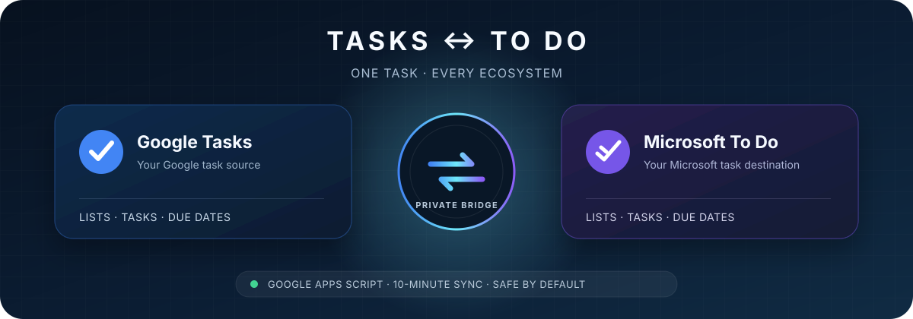
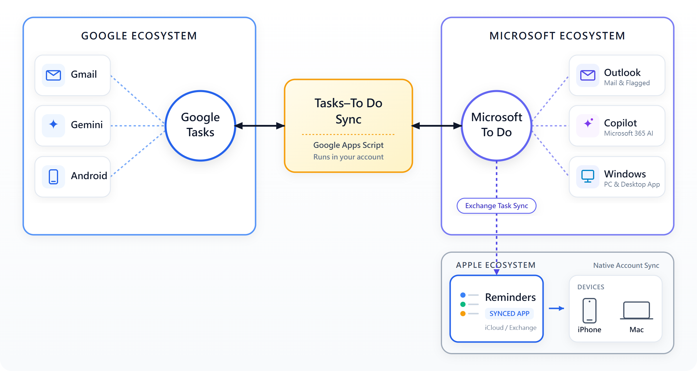

<div align="center">
  
</div>

<h1 align="center">Tasks–To Do Sync</h1>

<p align="center">
  <strong>Keep Google Task and Microsoft To Do in the same task loop.</strong><br>
  A private, self-hosted bridge for people who capture tasks in Google and continue them in Microsoft.
</p>

<p align="center">
  <a href="https://github.com/simonchai-tw/tasks-todo-sync/actions/workflows/ci.yml"></a>
  <a href="https://github.com/simonchai-tw/tasks-todo-sync/actions/workflows/github-code-scanning/codeql"></a>
  <a href="https://www.npmjs.com/package/tasks-todo-sync"></a>
  <a href="https://github.com/simonchai-tw/tasks-todo-sync/releases"></a>
  <a href="LICENSE"></a>
  
</p>

<p align="center">
  <a href="#why-it-matters">Why it matters</a> ·
  <a href="#how-it-works">How it works</a> ·
  <a href="#what-stays-in-sync">Features</a> ·
  <a href="#get-started">Get started</a> ·
  <a href="docs/quick-start.md">Quick start</a> ·
  <a href="https://github.com/simonchai-tw/tasks-todo-sync/graphs/contributors">Contributors</a>
</p>

---

## Why it matters

Your tasks do not always begin in the same app.

- Ask [Gemini to add a task](https://support.google.com/gemini/answer/15230285) while you are using Android.
- Turn [an email into a task](https://support.google.com/tasks/answer/7675838) without leaving Gmail.
- Create a To Do from a file in [Microsoft 365 Copilot](https://support.microsoft.com/en-us/microsoft-365-copilot/create-a-to-do-for-a-file-in-the-microsoft-365-copilot-app), then find it in To Do or Outlook.
- Keep using an existing Microsoft-connected [Apple Reminders](https://support.apple.com/en-lamr/guide/iphone/iph8739025dd/ios) workflow on your iPhone, iPad, or Mac.

Google and Microsoft each make this easy inside their own ecosystem. The missing piece is the connection between **Google Tasks** and **Microsoft To Do**.

Tasks–To Do Sync adds that connection. A task captured on one side can follow you to the other—without sending your task data through a hosted sync service.

## How it works

<p align="center">
  
</p>

1. **Capture in Google.** Gemini, Gmail, Android, and other Google experiences can place work in Google Tasks.
2. **Sync through your own project.** A private Google Apps Script installation keeps Google Tasks and Microsoft To Do aligned in both directions.
3. **Continue in Microsoft.** Use the synchronized tasks in Microsoft To Do and the Microsoft 365 experiences already connected to it. If your Microsoft account is part of your Apple Reminders setup, that existing connection can keep your Apple devices in the same personal workflow.

The project directly synchronizes **Google Tasks ↔ Microsoft To Do**. The surrounding Google, Microsoft 365, and Apple experiences are their native integrations—not features claimed or recreated by this project.

The private trigger runs every 10 minutes. Ordinary changes normally appear within 0–10 minutes; operations that require two complete confirmation rounds normally settle within 10–20 minutes.

## What stays in sync

| Capability | Direction | Notes |
|---|:---:|---|
| Create and edit tasks | Google ↔ Microsoft | Changes can begin on either side |
| Complete and reopen | Google ↔ Microsoft | Completion state follows the task |
| Notes | Google ↔ Microsoft | Plain-text projection |
| Due dates | Google ↔ Microsoft | Date only; Google Tasks has no time-of-day field |
| Personal lists | Google ↔ Microsoft | Eligible lists are discovered and paired automatically |
| Delete tasks and lists | Google ↔ Microsoft | Enabled by default with confirmation and recovery records |
| Move tasks between lists | Google ↔ Microsoft | Enabled by default with a durable move journal and live revalidation |

## A sync engine, not a chain of recipes

General automation platforms such as [Zapier](https://zapier.com/apps/google-tasks/integrations/microsoft-todo) and [Make](https://www.make.com/en/integrations/microsoft-to-do) can connect Google Tasks and Microsoft To Do through configurable triggers and actions. That flexibility is useful when every workflow is different. Keeping two task systems aligned, however, is a state problem—not just a “when this happens, do that” recipe.

- **One stateful loop.** Lists and tasks keep stable mappings across both services instead of relying on unrelated one-way automations.
- **The full task lifecycle.** Creation, edits, completion, reopening, due dates, lists, and guarded deletion are handled together so one event does not start an automation loop or resurrect old work.
- **Built for these two services.** Conflict checks, recovery journals, rename handling, and tombstones address the failure modes of task synchronization directly.
- **Owned by you.** The engine, credentials, and state stay in your Google Apps Script project. There is no Tasks–To Do Sync subscription, hosted account, or task database.

The core loop is covered by automated checks, GitHub CI, CodeQL, and bidirectional real-account validation. Detailed evidence and known limits are recorded in the [engineering audit](docs/audit.md).

## Get started

Create your private Apps Script project:

```bash
npx tasks-todo-sync init
```

The installer deploys the sync code to a standalone Google Apps Script project in your account and gives you the editor link for the remaining setup.

You will need:

- one Google account to own and run the Apps Script project;
- one Microsoft account to connect Microsoft To Do;
- your own Microsoft Entra application registration, following the guided setup.

You authorize Google and Microsoft separately. Each provider may show more than one sign-in or consent page depending on your existing browser session, but the project connects one account from each ecosystem.

Follow the **[quick start](docs/quick-start.md)** for the guided installation, or open the **[deployment guide](docs/deployment.md)** for manual setup, upgrades, rollback, and cross-list move details, including the delete-and-recreate metadata boundary.

## Documentation

| Guide | Use it for |
|---|---|
| [Quick start](docs/quick-start.md) | The shortest personal setup path |
| [Deployment guide](docs/deployment.md) | Entra registration, Apps Script, OAuth, upgrades, and rollback |
| [Engineering audit](docs/audit.md) | Verified behavior, limitations, and deferred work |
| [Security policy](SECURITY.md) | Reporting a vulnerability privately |
| [Changelog](CHANGELOG.md) | Release history |

Questions, ideas, or something not working? [Open an issue](https://github.com/simonchai-tw/tasks-todo-sync/issues/new/choose).

## License

Tasks–To Do Sync is available under the [MIT License](LICENSE).
