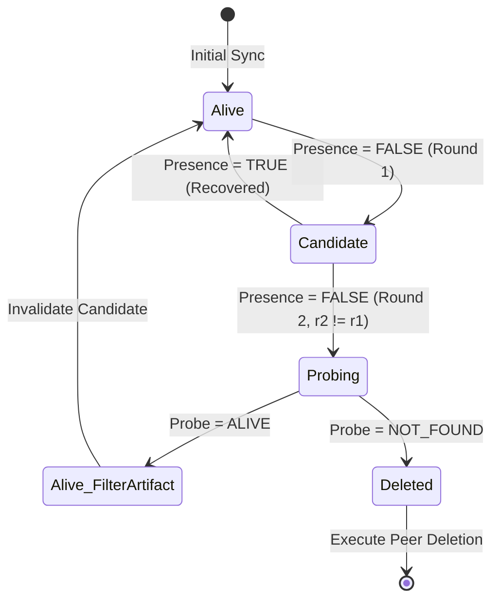

# Tasks-ToDo-Sync Scheduler Invariants

This document formalizes the three core synchronization scheduler invariants of the engine. These invariants guarantee safe and deterministic convergence of task synchronization across Google and Microsoft task APIs, ensuring no false deletions, complete observation slices, and guaranteed finite-time eventual observation for any mapped task list.

## 1. $R$-Completeness (Atomic Snapshot Completeness)

**Definition:**
The state matrix $R$ (Remote Observation) representing the task contents across Google and Microsoft collections for a given mapped pair MUST be complete and contiguous. Partial or interrupted pagination must cause a safe fail-closed.

**Formal Specification:**
Let $T$ be the total set of items retrievable for pair $p$ in round $r$.
The engine paginates the provider to construct $S \subseteq T$.
Let $\text{status}(S)$ be the state of the pagination process, where $\text{status}(S) \in \{\text{SUCCESS}, \text{PAGINATION\_TIMEOUT}, \text{PAGE\_LIMIT\_EXCEEDED}, \text{MALFORMED\_PAGE}, \text{API\_ERROR}\}$.

**Invariant:**
$$ \forall p \in \text{ObservedPairs}(r): \text{status}(S_p) = \text{SUCCESS} \iff \text{MutationsExecuted}(p, r) \ge 0 $$
$$ \exists p, \text{status}(S_p) \neq \text{SUCCESS} \implies \text{MutationsExecuted}(p, r) = 0 \land \text{DeletionCandidatesPromoted}(p, r) = 0 \land \text{RemoteWrites}(p, r) = 0 $$

**Proof of Safety:**
If pagination fails part-way through, $S \subset T$. If the engine proceeded to reconcile, $x \in (T \setminus S)$ would appear to be deleted remotely since it is absent from $S$. By forcing a complete abort (fail-closed) on any non-`SUCCESS` pagination state, we mathematically prevent any subset $T \setminus S$ from erroneously generating synthetic deletion operations. 0 state mutations are persisted, preserving the previous correct known state vector.

---

## 2. Two-Round Deletion with Absence Probe Soundness

**Definition:**
To prevent deletion operations caused by transient API anomalies, indexing delays, or filter artifacts, an item observed as missing must be confirmed missing in a strictly disjoint execution round, AND directly probed via ID to confirm it is completely missing from the API.

**Formal Specification:**
Let $\text{Presence}(id, r)$ be the inclusion of $id$ in the list response during round $r$.
Let $\text{Probe}(id)$ be the result of a direct provider `GET /tasks/{id}` request.

**State Transitions:**
1. **Round 1 (Candidate generation):**
   If $\text{Presence}(id, r_1) = \text{FALSE}$ and previously known alive:
   $$ \text{CandidateState}(id, r_1) = \{ \text{confirmations: } 1, \text{lastRoundId: } r_1 \} $$
   Execution: Deletion is deferred.
   
2. **Round 2 (Confirmation & Probe):**
   In round $r_2$ where $r_2 \neq r_1$:
   If $\text{Presence}(id, r_2) = \text{FALSE}$:
   We execute $P = \text{Probe}(id)$.
   - If $P = \text{ALIVE}$: Candidate invalidated with `ABSENCE_WAS_FILTER_ARTIFACT`.
   - If $P = \text{NOT\_FOUND}$: Deletion executed on peer.

**Proof of Soundness:**
The requirement $r_2 \neq r_1$ guarantees a temporal gap (at least the time between two trigger executions, typically 5-10 minutes), absorbing short-lived read-after-write eventual consistency anomalies.
The direct $\text{Probe}(id)$ circumvents list-level filtering/indexing mechanisms on the provider side. Since $P = \text{NOT\_FOUND}$ is derived from the canonical key-value store of the provider, and not its search index, the deletion is strictly confirmed against the source of truth.

---

## 3. Starvation-Free Rotating Observation Cursor

**Definition:**
With an observation budget limit $B$ (default 10) per execution round, all $N$ mapped list pairs must be systematically observed in a guaranteed finite time bounded by $\lceil N / B \rceil$ rounds, ensuring no starvation even when $N$ changes dynamically.

**Formal Specification:**
Let $N$ be the number of mapped pairs.
Let $B$ be `RESOURCE_OBSERVATION_MAX_PAIRS_` (budget).
Let $C_r$ be the `resourceObservationCursor` at the start of round $r$.
The slice observed in round $r$ is:
$$ \text{Slice}(r) = \text{Pairs}[C_r \dots \min(C_r + B - 1, N-1)] $$
Next cursor:
$$ C_{r+1} = (C_r + B) \pmod N $$

**Theorem (Bounded Observation Delay):**
Every mapped pair $p_i$ is observed at least once within any continuous sequence of $\lceil N / B \rceil$ normal execution rounds.

**Proof of Guarantee:**
Assuming $N$ is stable, the cursor advances by $B$ each round. The total domain is covered completely in $\lceil N / B \rceil$ steps because the arithmetic progression $C_r + kB$ wraps around modulo $N$.
If $N$ changes (e.g., pairs added/removed):
- If $N$ decreases such that $C_r \ge N$, the cursor is safely clamped or wrapped modulo the new $N$, resuming valid slice selection.
- If $N$ increases, new elements appended at the end will be visited when the cursor next wraps around or reaches them, preserving the maximum wait time of $\approx \lceil N_{new} / B \rceil$ rounds.
Therefore, no element can wait indefinitely (starvation), as the strictly monotonic advance of the un-moduloed cursor guarantees cyclic coverage of the entire array space.

---

### Mermaid State Transitions

#### Deletion State Machine

---

## Measured coefficients (live, real account)

*Status: MEASURED (Run 1: 2026-09-15 23:02:26 GMT+8; Run 2: 2026-09-16 00:08:58 GMT+8; Account Shape: G=1 list/0 tasks/1 page, MS=2 lists/0 tasks/2 pages)*  
*Source: `.workbuddy-ai/evidence/r-coefficient-20260915.md` via `runRCoefficientProbe()`*

| Coefficient | Measured Latency | Per-Unit Empirical Rate | Measurement Status & Variance Notes |
|:---|:---:|:---:|:---|
| **S0 Base overhead** | **277 ms** | Lock acquire + state load | MEASURED (stable baseline) |
| **S1 Google Lists** | **441 ms** | ~441 ms / Google list inventory | MEASURED |
| **S2 Microsoft Lists** | **443 ms** | ~443 ms / Microsoft list inventory | MEASURED |
| **S3 Google Tasks (per-G-page)** | **199 ms** | ~199 ms / page (1 page observed) | MEASURED `[空頁、單發、高變異]` *(註：昨晚 lab 量測為 458ms，空頁 vs 帶資料頁有顯著變異)* |
| **S4 Microsoft Tasks (per-MS-page)** | **905 ms** | ~452.5 ms / page (2 pages observed) | MEASURED `[空頁、單發、高變異]` *(註：昨晚 lab 量測為 278ms，空頁 vs 帶資料頁有顯著變異)* |
| **S5 Complete Snapshot Build** | **2,333 ms** | Cross-verification against sum(S0..S4) | MEASURED (與 S0..S4 總和中位數 2,438ms 差距僅 105ms) |
| **$R_{\text{floor}}$ (Empty Snapshot)** | **2,438 ms** (~2.44 s) | Baseline empty structural cycle | MEASURED (空帳號地板價，隨任務量與分頁數線性增長) |
| **$C_{\text{reconcile}}$ (All-Pair Reconcile)** | **370 ms / pair** | `reconcileMapped_` 全配對對帳 | MEASURED (2026-09-14 真帳號實測，每輪遍歷所有 $N$ 配對) |
| **$V_{\text{inspect}}$ (Deep Inspection)** | **521 ms / pair** | Checklist (258ms) + LinkedResources (263ms) | MEASURED (2026-09-15 benchmark，僅套用於輪替游標挑出的 $B \le 10$ 配對) |
| **$W_{\text{create}}$** | **660 ms / item** | 平均單筆任務建立耗時 | MEASURED (2026-09-14 benchmark) |
| **$W_{\text{delete}}$ (Legacy Unbatched)** | **1,700 ms / item** | 單筆刪除即時存檔 | MEASURED (2026-09-13 benchmark) |
| **$W_{\text{delete}}$ (S2 Batched)** | **385 ms / item** | 預留日誌合併批次刪除 | MEASURED (2026-09-15 benchmark，4.4 倍速提升) |

---

### Snapshot Scaling Model $R(P_G, P_{MS})$

$R_{\text{floor}} = 2.44\text{ s}$ 僅代表空帳號（0 任務）的結構性基底開銷（全域鎖 + 狀態載入 + 清單目錄掃描）。在真實帳號中，快照開銷隨任務分頁數 $P_G, P_{MS}$（每頁上限 100 筆）線性增長：

$$ R(P_G, P_{MS}) = R_{\text{floor}} + \text{rate}_G \times P_G + \text{rate}_{MS} \times P_{MS} $$
$$ R(P_G, P_{MS}) \approx 2.44\text{ s} + 0.199 \times P_G + 0.453 \times P_{MS}\quad (\text{秒}) $$

| 負載等級 | 任務配對數 $N$ | 分頁數估計 ($P_G, P_{MS}$) | 估算快照時間 $R$ |
|:---|:---:|:---:|:---:|
| **Empty Account** | $N = 0$ | $P_G = 1, P_{MS} = 2$ | **2.44 s**（實測地板價） |
| **Light Load** | $N = 100$ | $P_G = 1, P_{MS} = 1$ | **3.09 s** |
| **Standard Operating Envelope** | $N = 300$ | $P_G = 3, P_{MS} = 3$ | **4.40 s** |
| **Stress Boundary** | $N = 600$ | $P_G = 6, P_{MS} = 6$ | **6.36 s** |

*(注意：分頁讀取率具網路變異性，待累積帶任務真實帳號數據後持續校準。)*

---

### Complete Budget Equation (完整排程預算恆等式)

排程輪次的可用預算上限為 $270\text{ s}$ ($315\text{ s} \text{ RUN\_LIMIT\_MS} - 45\text{ s} \text{ DESTRUCTIVE\_OPERATION\_RESERVE\_MS}$)。
每一輪必須包含：
1. **$R(P_G, P_{MS})$**：雙邊清單與任務快照讀取。
2. **$C_{\text{reconcile}} \times N$**：全量 $N$ 個已映射配對的基本差量對帳（`reconcileMapped_`，耗時 $0.37\text{ s} \times N$）。
3. **$V_{\text{inspect}} \times B$**：受預算保護的 $B \le 10$ 配對輪替深層資源觀測（子任務 258ms + 附加資源 263ms = $0.521\text{ s} \times B$）。
4. **$W_{\text{create}} \times n_{\text{create}}$**：新任務批次建立（每批上限 25 筆，每筆 $0.66\text{ s}$）。
5. **$W_{\text{delete}} \times m_{\text{delete}}$**：兩輪確認後的刪除執行（S2 批次化後每筆 $0.385\text{ s}$）。

完整恆等式如下：

$$ R(P_G, P_{MS}) + 0.37 \times N + 0.521 \times B + 0.66 \times n_{\text{create}} + 0.385 \times m_{\text{delete}} \le 270\text{ s} $$

> 註記：$0.385 \times m_{\text{delete}}$ 是「S2 批次化已啟用」的前提；遇到未批次 fallback（如 legacy journal）應回退 $1.70\text{ s}$ 保守界限。

#### 負載餘量階梯分析（Margin Analysis）：

1. **空帳號 ($N = 0, B = 0$)**：
   - 固定開銷：$2.44\text{ s} + 0 + 0 = \mathbf{2.44\text{ s}}$
   - 剩餘預算：$270 - 2.44 = \mathbf{267.56\text{ s}}$。

2. **一般帳號 ($N = 100, B = 10$)**：
   - 固定開銷：$3.09\text{ s} + (0.37 \times 100) + (0.521 \times 10) = 3.09 + 37.00 + 5.21 = \mathbf{45.30\text{ s}}$ (佔預算 16.8%)
   - 剩餘突變預算：$270 - 45.30 = \mathbf{224.70\text{ s}}$。

3. **滿載帳號 ($N = 300, B = 10$) —— 正式運算包絡線**：
   - 固定開銷：$4.40\text{ s} + (0.37 \times 300) + (0.521 \times 10) = 4.40 + 111.00 + 5.21 = \mathbf{120.61\text{ s}}$ (佔預算 44.7%)
   - 剩餘突變預算：$270 - 120.61 = \mathbf{149.39\text{ s}}$。
   - 足以在單輪內完整執行上限 25 筆建立 ($16.5\text{ s}$) 與超過 300 筆批次刪除 ($300 \times 0.385\text{s} = 115.5\text{s}$)，預算裕度充足且真實。

4. **極限壓力帳號 ($N = 600, B = 10$) —— 壓力邊界**：
   - 固定開銷：$6.36\text{ s} + (0.37 \times 600) + (0.521 \times 10) = 6.36 + 222.00 + 5.21 = \mathbf{233.57\text{ s}}$ (佔預算 86.5%)
   - 剩餘突變預算：$270 - 233.57 = \mathbf{36.43\text{ s}}$。
   - 此時建立批次將受到 `TIME_BUDGET_CREATE` 守衛（預留 45s）保護自動平順延至下輪，符合 fail-closed 設計保證。

